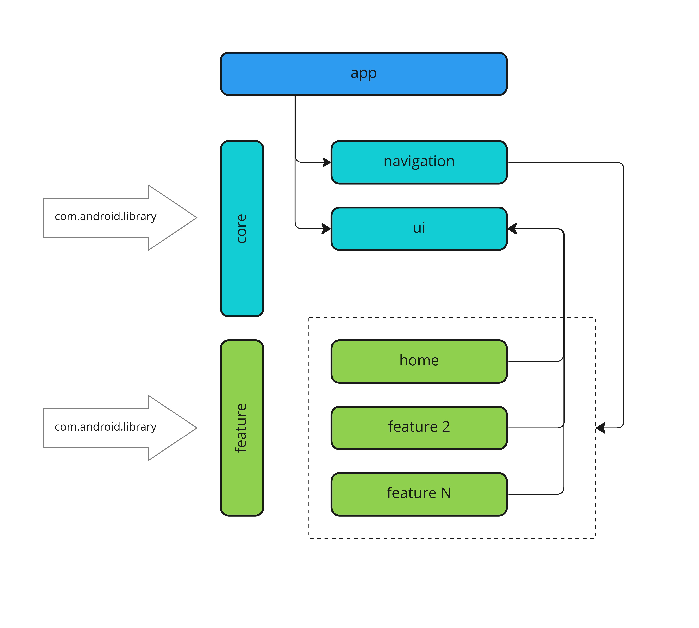

# E2E chat app

[](https://www.codefactor.io/repository/github/mobiledevpro/jetpack-compose-chatapp-template)
[](https://sonarcloud.io/dashboard?id=mobiledevpro_Jetpack-Compose-ChatApp-Template)

[](http://kotlinlang.org/)
[]([http://kotlinlang.org/](https://developer.android.com/jetpack/compose/bom/bom-mapping))
[](https://developer.android.com/build/releases/gradle-plugin)
[](https://github.com/AndroidSDKSources/android-sdk-sources-list)
[](https://developer.android.com/about/versions/13)
[](http://www.apache.org/licenses/LICENSE-2.0)
[](https://developer.android.com/studio/preview)


##
### Tech. stack

* [Kotlin](https://kotlinlang.org/docs/getting-started.html)
* [Coroutines](https://kotlinlang.org/docs/coroutines-overview.html)
* [Jetpack Compose](https://developer.android.com/jetpack/compose) modern toolkit for building native UI
* [Jetpack libs: Navigation, Compose, etc.](https://developer.android.com/jetpack)
* [Material 3](https://m3.material.io/)
* [Koin](https://insert-koin.io/docs/reference/koin-android/compose) for dependency injection
* [Coil](https://coil-kt.github.io/coil/compose/) for image loading
* MVI + modularization with a clean architecture
* [Circle CI](https://circleci.com/) for continuous integration and delivery

##
## UI testing with [Maestro](https://maestro.mobile.dev/):

* Install Maestro: run in terminal ```curl -Ls "https://get.maestro.mobile.dev" | bash```
* Install the app on emulator (doesn't work with physical device)
* Run the flow: run in terminal ```maestro test -c maestro/people-profile-flow.yaml```
* [Sample config](maestro/people-profile-flow.yaml)

##
## Modularization



##
## Author:

<a href="https://github.com/AkashShahriar55" target="_blank">
  
</a>

**Akash Shahriar**


[](https://www.linkedin.com/in/akash-shahriar-784362194/)